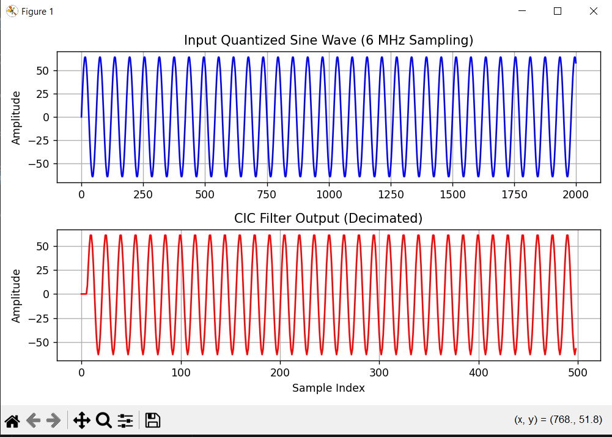

# CIC_Decimator  

A parameterizable **Cascaded Integrator–Comb (CIC) Decimation Filter** implementation in Verilog, with Python-based input generation and waveform verification.

---

## 📁 Repository Contents  
| File | Description |
|------|--------------|
| `CIC.v` | Verilog module implementing the CIC decimator (configurable width, number of stages, and runtime `D`). |
| `tb_CIC.v` | Verilog testbench reading input from file, running the CIC, and logging decimated output. |
| `sine.py` | Python script generating a fixed-point integer sine wave stimulus (`input.txt`). |
| `input.txt` | Text file of sine wave samples used as testbench input. |
| `output.txt` | Output data file written by the Verilog testbench after decimation. |
| `CIC_Check.py` | Python script to verify, compare, and plot input vs output signals. |
| `Check.PNG` | Example plot showing decimation and amplitude scaling behavior. |

---

## ✅ Features  
- Configurable parameters:  
  - `INPUTWIDTH` — Input data width (default = 8 bits)  
  - `N` — Number of integrator/comb stages (default = 4)  
  - `D` — Runtime decimation factor (e.g., 4, 8, 16, 32)  
- Fully synthesizable and simulation-ready  
- Fixed-point integer data path (no floating-point hardware)  
- Integrated Python generation and verification flow  
- Supports Icarus Verilog, ModelSim, Questa, Vivado, and Quartus simulators  

---

## 🧪 Usage Guide  

### 1️⃣ Generate Input Samples
Run the sine generator to create `input.txt`:
```bash
python3 sine.py
```
This produces 2000 samples of a 100 kHz sine wave at 6 MHz sampling frequency, quantized to 8-bit signed integers.

---

### 2️⃣ Simulate the Verilog Module
#### ▶ Using **Icarus Verilog**
```bash
iverilog -o sim CIC.v tb_CIC.v
vvp sim
```
#### ▶ Using **ModelSim / Questa**
```tcl
vlog CIC.v tb_CIC.v
vsim tb_CIC
run -all
```
The testbench automatically:
- Reads `input.txt`
- Drives it into the CIC filter  
- Writes decimated samples to `output.txt`

---

### 3️⃣ Verify Results in Python
Run the check script to visualize and confirm the output:
```bash
python3 CIC_Check.py
```

**Expected Output:**
- The **top plot**: Input sine wave sampled at 6 MHz  
- The **bottom plot**: Decimated sine wave (every Dth sample) with amplitude adjusted by filter scaling  
- The printed ratio of input/output lengths ≈ decimation factor `D`

---

## ⚙️ Configuration Notes
- Adjust `D` directly in the testbench before running simulation.  
- Modify `INPUTWIDTH` and `N` parameters in `CIC.v` to test other architectures.  
- For large `D`, internal growth is handled by automatic bit-width expansion with +4 headroom bits.  
- Amplitude scaling logic prevents saturation and distortion at high decimation factors.

---

## 📊 Example Results
Below is a visualization of the **input vs. decimated output** as plotted by the verification script:


